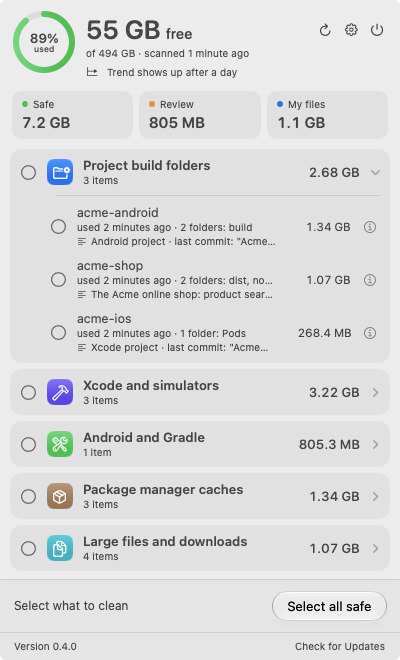

[](https://github.com/fredy-mederos/vibe_clean/releases/latest)

<br clear="left"/>

# Vibe Clean

A small menu bar app that shows how much disk space is left, how fast it's shrinking, and lets
you pick developer junk to clean: Xcode DerivedData, Gradle caches, project `build/` and
`node_modules/` folders, old simulator runtimes, old IDE versions, package manager caches, Docker
data, plus your own large files and forgotten downloads.

Cleaning is always manual: nothing is deleted until you select it and confirm.

<p align="center">
  
</p>

## Download

**[Download VibeClean.dmg](https://github.com/fredy-mederos/vibe_clean/releases/latest/download/VibeClean.dmg)**
(the latest release, for macOS 14 or later on Apple silicon and Intel), open it and drag Vibe Clean into
Applications. Every version is on the [releases page](https://github.com/fredy-mederos/vibe_clean/releases).

Vibe Clean was called KeepMyMacClean until version 1.2.0. If you had it, move KeepMyMacClean to the Trash after
installing Vibe Clean: your settings and free-space history carry over (they stay in
`~/Library/Application Support/KeepMyMacClean`). Then check Settings → Open at login once.

It tells you when there's a new version: the bottom of the menu bar window shows the version and Check
for Updates, which turns into a green Update Available when GitHub has a newer release (it asks when
the app starts and once a day). Settings → Updates shows the same, with Download.

## Build and run

```bash
./scripts/build-app.sh --install   # builds "dist/Vibe Clean.app", copies it to ~/Applications, launches it
swift run KeepMyMacClean           # quick dev run (no notifications or login item outside a .app)
swift test                         # unit tests (use a fake home folder, never touch real files)
swift run kmmc scan                # read-only: print what the app would find
swift run kmmc discover            # read-only: show where your projects were found
swift run kmmc history             # read-only: free-space samples and the current trend
swift run kmmc digest [--sample]   # read-only: the weekly summary (needs 2 days of history; --sample fakes a week)
swift run kmmc projects            # read-only: stack, description and git activity of each project
```

The app icon is drawn in code: `swift scripts/make-icon.swift` writes `Resources/AppIcon.icns` (and a 1024 px
PNG preview), which `build-app.sh` copies into the bundle.

`build-app.sh` stamps each build: the version in `Resources/Info.plist` (`scripts/version.sh` prints or sets it),
the build number (commit count), the short commit hash (`+` when built with uncommitted changes) and the build
date. Settings → About shows them, the same rows as Vibe GitTree and Vibe Notepad.

Debug builds check for updates only when asked. `-CheckForUpdates YES` checks at launch as the released app does,
`-UpdateRepository owner/name` tries another repository's releases (one with a newer version shows Update
Available), and `-OpenMenuBarWindow YES` opens the menu bar window at launch:

```bash
CONFIG=debug scripts/build-app.sh
open -n "dist/Vibe Clean.app" --args -UpdateRepository fredy-mederos/devwispr -OpenMenuBarWindow YES
```

## Releasing

`scripts/release.sh` builds the app for Apple silicon and Intel, signs it with a Developer ID (with the hardened
runtime), packs it into `dist/VibeClean.dmg`, has Apple notarize it and staples the ticket:

```bash
APP_SIGN_IDENTITY="Developer ID Application: Your Name (TEAMID)" \
  NOTARY_KEYCHAIN_PROFILE=<profile> scripts/release.sh
```

The `release-vibe-clean` skill (`skills/`, linked for Claude Code and Codex) runs a whole release: it picks and
confirms the version, builds the disk image, tags `vX.Y.Z` and publishes the GitHub release with notes from
`scripts/release-notes.sh`. Installed copies find it within a day.

On first launch the app walks your home folder for projects and remembers their parent folders
(`~/Documents/projects`, `~/AndroidStudioProjects`...). Edit them in Settings. macOS asks once for
access to Documents, Desktop and Downloads.

## How items are classified

| Kind | Meaning | Examples |
|---|---|---|
| Safe | The owning tool recreates it. Cost: a slower next build or a re-download. | DerivedData, project build folders, Gradle build cache, npm/pnpm caches, unavailable simulators |
| Review | Probably not needed, but worth a look. | iOS DeviceSupport, simulator runtimes, old Android Studio versions, Gradle dependencies, CocoaPods specs repo, older SDK platforms, unused Docker images and volumes |
| My files | Your own files. Only ever moved to the Trash, with a suggestion for each. | Installers, archives already extracted, APK/IPA builds, videos, VM disks, ML models, old downloads |

Caches are deleted permanently (moving gigabytes of caches to the Trash frees nothing); your own files
go to the Trash.

Every item says why it's listed, what cleaning costs and what happens afterwards (the ⓘ button). Review
rows show the cost inline, colored by level:

| Cost level | Meaning | Examples |
|---|---|---|
| Rebuild | Recreated locally, next build is slower | DerivedData, Gradle build cache |
| Re-download | Fetched again from the network | Simulator runtimes ("~8.8 GB from Apple"), Gradle dependencies, SDK platforms |
| Lose an option | No data lost, but a possibility is gone | Toolbox rollback backups, old IDE settings |
| Data loss | Can't be recovered (red, and called out when confirming) | Emulators, Docker volumes and stopped containers, Xcode archives (dSYMs) |

Facts come from your projects where cheap: which Gradle version each project's wrapper uses, which API levels
they compile against, which Podfiles still use the git CocoaPods specs, how many simulators use a runtime.

Where a tool has its own cleanup command, the app uses it (`xcrun simctl delete unavailable`,
`xcrun simctl runtime delete`). Every path passes `PathGuard` before deletion: it must be at least two levels
inside your home folder and never one of the well-known folders.

A project folder is only deleted when it passes two checks:

1. **It's a known build folder** in the place its tool puts it: `build/` next to `build.gradle(.kts)` or
   `pubspec.yaml`, `node_modules/` next to `package.json`, `Pods/` next to `Podfile`, `vendor/bundle/` with a
   `Gemfile`, NuGet `packages/` next to a `.sln`, Flutter's `ios/Flutter/*.framework`, Elixir `_build/` and
   `deps/`, `.venv/`, `dist/`, `.playwright-cli/` and so on (`ProjectArtifacts.rules`).
2. **Git ignores it** (the folder, or every file in it) **and nothing inside is tracked** (`GitIgnoreCheck`).

Git only ever removes folders from the list, never adds them, so gitignored app data (`data/`, `uploads/`,
`captures/`, `.env`, worktrees) is never offered. Folders that fail the git check are kept and listed in the ⓘ
popover with the reason. Projects outside git can't be confirmed, so they're Review instead of Safe.
The ⓘ popover lists every folder that will be deleted.

## Smarter suggestions (optional)

With Settings → Suggestions → "Smarter suggestions (on-device AI)" on (macOS 26+ with Apple Intelligence),
Apple's on-device Foundation Models write a one-line suggestion for each of your own files from its name, type,
folder, size and dates. Suggestions are generated when a row appears, cached in
`~/Library/Application Support/KeepMyMacClean/suggestions.json`, and fall back to the fixed text. The model
only writes text; it never changes what an item is or what cleaning does. Nothing leaves your Mac.

Project rows show what each project is. The app reads the stack (Next.js, Flutter, Android…), the project's own
description (package.json, pubspec.yaml or the README's first paragraph, skipping template text and bare links)
and git activity. With Smarter suggestions on, the model condenses descriptions that are long or not in English
("React escape room prototype inspired by Rusty Lake games"); it never sees dates, so it can't misjudge activity.
Without a description the line is built from the stack and latest commit, because in testing the model only
guessed from the folder name. `swift run kmmc projects` lists what the app knows about each project.

## Free space history

The app samples free space every 30 minutes while it runs and keeps 90 days in
`~/Library/Application Support/KeepMyMacClean/history.json`. The trend ("−2 GB/day · full in ~14 days")
uses the last 7 days and ignores jumps up from cleanups, so cleaning doesn't hide how fast the disk fills.
A full scan runs every 6 hours; categories that grew more than 500 MB in about a week show it.
A notification fires when free space drops below your threshold, or when the current pace fills the disk within a week.

Once there are 2 days of history, the popover shows a summary card ("Free space down 9 GB this week. Xcode and
simulators grew 6.1 GB, mostly Acme build data…") with a shortcut that selects the item that grew the most. With
a full week of history it's also sent as a weekly notification (Settings → Alerts). `swift run kmmc digest`
prints it; `--sample` shows a made-up week.

The summary is written by the app, not a language model: in testing, Apple's on-device model reworded it
accurately but kept dropping the most useful details (which item grew, the pace, what you cleaned).

## Layout

- `Sources/CleanerCore`: scanning, sizing, project discovery, cleaning. No UI.
  - `Scanners/`: one scanner per category. Scanners list items quickly and return probes; `ScanEngine`
    measures probes in parallel and streams results.
- `Sources/KeepMyMacClean`: SwiftUI `MenuBarExtra` app (the code keeps the app's first name), with its version info
  and update checks (`UpdateCheck.swift` is the same file in Vibe GitTree and Vibe Notepad).
- `Sources/kmmc`: read-only CLI.
- `Tests/CleanerCoreTests`: Swift Testing suite.
- `Tests/KeepMyMacCleanTests`: the update check's version comparison and GitHub parsing.

## Roadmap

1. ✅ Menu bar free space, dev cleaners (safe + review), project discovery, low-space alert, open at login
2. ✅ One-click selection of inactive projects and DerivedData, older Android SDK platforms/sources/build tools, Docker (`docker system df` + prune)
3. ✅ Large files and downloads with suggestions (Trash only), free-space history, trend and "days until full", category growth, redesigned popover
4. ✅ Cost of cleaning on every item (reason, cost level, ⓘ details, data-loss warning), optional on-device AI suggestions, build version in Settings
5. ✅ Weekly summary of what changed, with a shortcut to the biggest grower
6. ✅ Project one-liners: stack, description and git activity, condensed on-device when long or not in English
7. Explaining unknown big folders (curated list + optional cloud model)
8. Treemap explorer, Full Disk Access view of hidden space (Trash, Photos, device backups)
